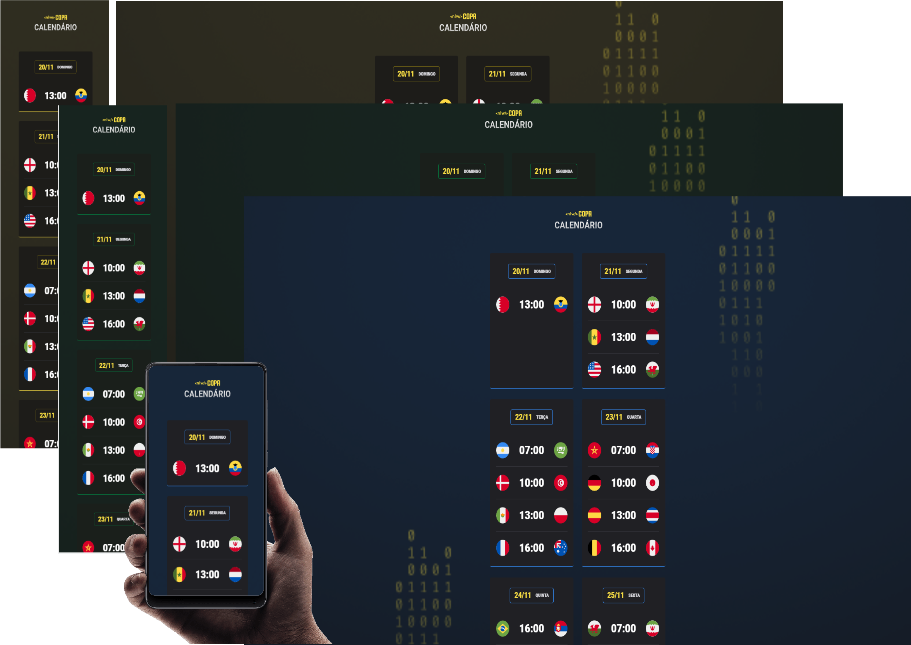

# NLW #10 Copa

> <b>10ª NLW Rocketseat</b>

> Projeto feito na decima edição do NLW da Rocketseat :rocket:. 

## :hammer_and_wrench: Tecnologias

- HTML
- CSS
- Javascript
- Git e Github

### CSS
- display grid e flex
- Centralizar os elementos HTML usando self

### Javascript
- DOM
- Event-driven, programação imperativa e callbacks
- Refatoração
- Clean Code
- Funções em Javascript
- Estrutura de dados com objetos;

## :dart:  Projeto

:heavy_check_mark:  Criar um calendário de jogos da copa do mundo de 2022 usando HTML, CSS e Javascript
## :memo: Licença

Esse projeto está sob licença MIT
## :mailbox_closed: Contatos

> Email - rosendc30@gmail.com

> Linkedin - https://www.linkedin.com/in/francisco-rosendo-a05623241/
